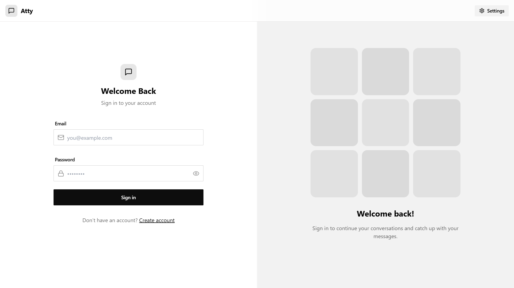
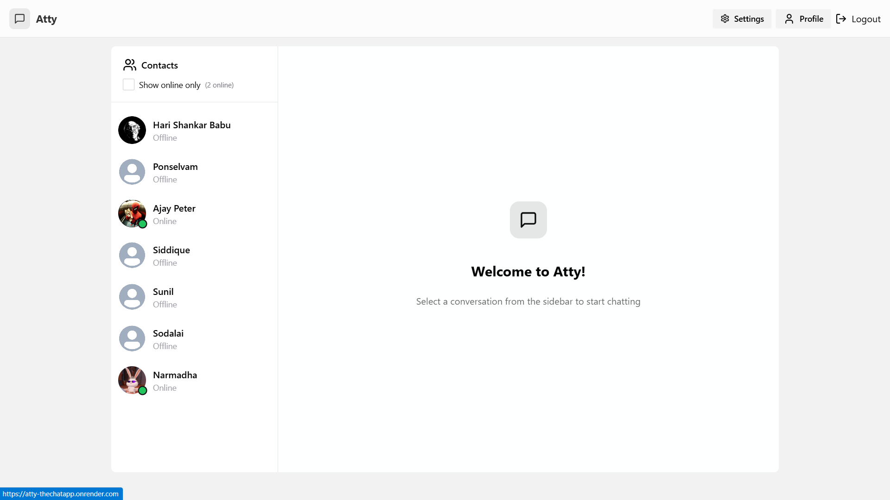
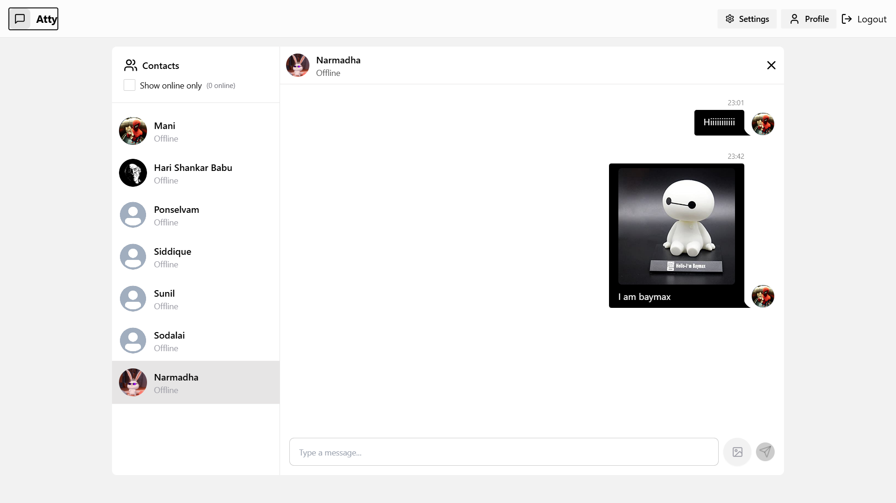

# Atty - Chat App

A real-time chat application built using the MERN stack with Socket.io for smooth messaging. The frontend is designed with React, Tailwind CSS, and Daisy UI.

## 🚀 Features
- Supports up to 30 themes using Daisy UI
- Works flawlessly on mobile devices
- Can exchange text messages and even images
- Supports up to 30 themes using Daisy UI
- Real-time messaging with Socket.io
- User authentication (Signup/Login)
- Responsive and modern UI with Tailwind and Daisy UI
- Online/offline status indicators

## 🖥️ Screenshots

### Login Page


### Home Page


### Chat Interface



## 🛠️ Tech Stack

### Frontend
- React
- Tailwind CSS
- Daisy UI
- Socket.io-client

### Backend
- Node.js
- Express.js
- MongoDB
- Socket.io

## 📦 Installation

### 1️⃣ Clone the repository
```sh
git clone https://github.com/AjayPeter582/Atty-theChatApp.git
cd Atty-theChatApp
```

### 2️⃣ Install dependencies
#### Backend
```sh
cd backend
npm install
```
#### Frontend
```sh
cd frontend
npm install
```

### 3️⃣ Setup environment variables
Create a `.env` file in the `backend` directory and add:
```
MONGO_URI=your_mongodb_connection_string
JWT_SECRET=your_secret_key
SOCKET_PORT=5000
```

### 4️⃣ Run the application
#### Start the backend server
```sh
cd backend
npm run start
```
#### Start the frontend
```sh
cd frontend
npm run start
```

## 🌍 Deployment
- **Frontend:** Hosted on Render
- **Backend:** Hosted on Render
- **Database:** MongoDB Atlas

## 🤝 Contributing
Feel free to fork and contribute! Pull requests are welcome.

## 📜 License
This project is licensed under the MIT License - see the [LICENSE](LICENSE) file for details.

---
**Developed by [Ajay Peter](https://github.com/AjayPeter582)**

